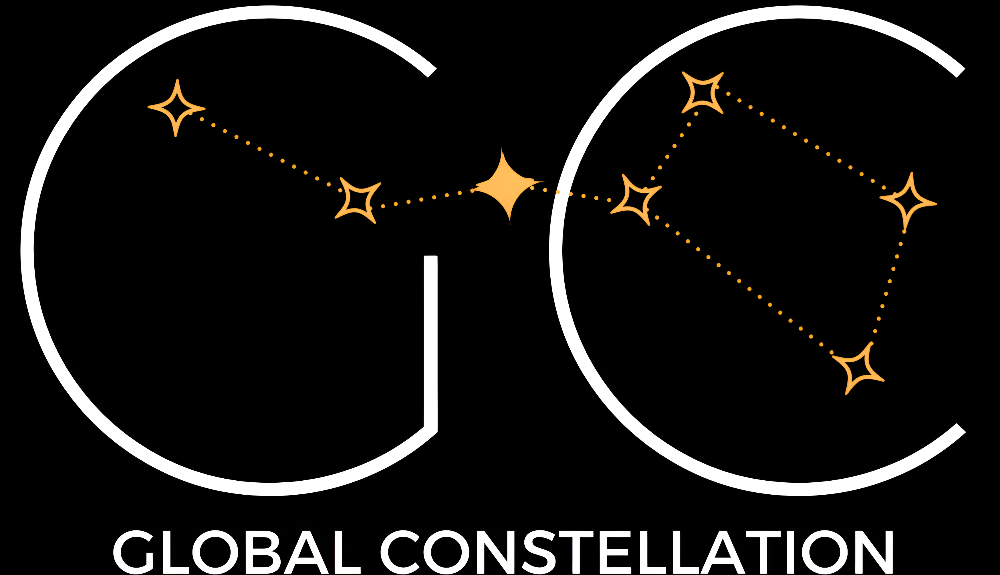

<div align="center">
  <a href="https://landing-page-gc.netlify.app/" target="_blank">
   
  </a>
  <h3>
    <strong>Landing page del proyecto GC</strong>
  </h3>
</div>

Página incial del proyecto Global Constellation donde están unificadas todas las herramientas de trabajo, documentación y comunicación.

El proyecto es Open Source, así que si te interesa aportar es super bienvenido.

## 🚀 Contribuir

1. Para contribuir, crea un [Fork](https://github.com/glaboryp/landing-page-gc/fork) del proyecto.

2. Clona el repositorio en tu máquina local:

    ```bash
    git clone git@github.com:tu_username/landing-page-gc.git
    ```

3. Instala las dependencias y ejecuta la aplicación en local
    ```bash
    pnpm install
    pnpm dev run
    ```

4. Realiza los cambios y crea una pull request 🚀

## 🛠️ Stack
- [**Astro**](https://astro.build/) - The web framework for content-driven websites
- [**Tailwindcss**](https://tailwindcss.com/) - A utility-first CSS framework for rapidly building custom designs.
- [**ESLint**](https://eslint.org/) - Find and fix problems in your JavaScript code
- [**Prettier**](https://prettier.io/) - An opinionated code formatter.
